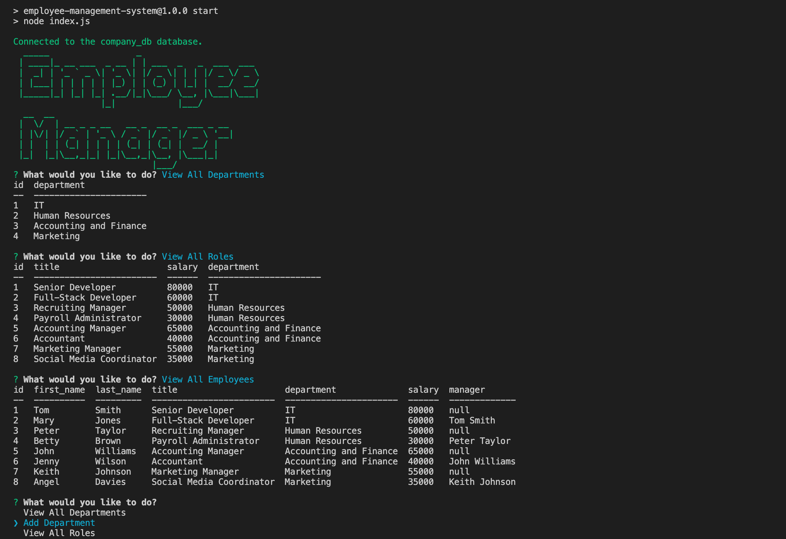

# Employee Management System

## This is the repository for the employee management system

## Table of Contents

- [Description](#description)
- [Installation](#installation)
- [Usage](#usage)
- [Screenshot and the Walkthrough Video](#screenshot-and-the-walkthrough-video)
- [Teachologies Used](#technologies-used)
- [License](#license)
- [Contact Me](#contact-me)

### Description

An employee management system which enable users to use CLI to view and manage the departments, roles and employees in the company.

### Installation

```
git clone git@github.com:angelawong3/employee-management-system.git
cd employee-management-system
npm install inquirer@8
npm install mysql2
npm install console.table
npm install colors
npm install figlet
```

### Usage

```
node index.js
or
npm run start
```

### Screenshot and the Walkthrough Video


<br />
Download the walkthrough video [here]()

### Technologies Used

1. JavaScript
2. Node.js
   - Inquirer.js
   - Node MySQL 2
   - console.table
   - colors.js
   - Figlet.js

### License

[](https://opensource.org/licenses/MIT)

### Contact Me

Please contact me at angelawong3@yahoo.com

---

© 2022 Angela Wong
